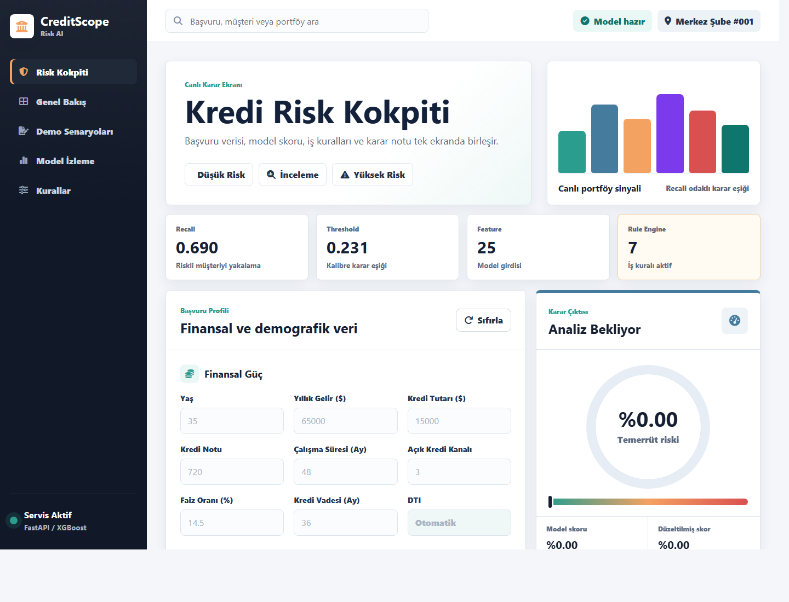
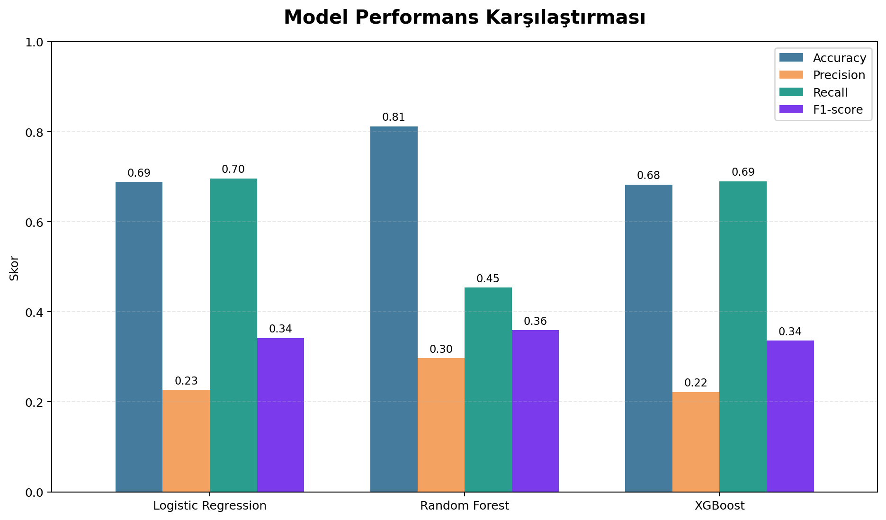
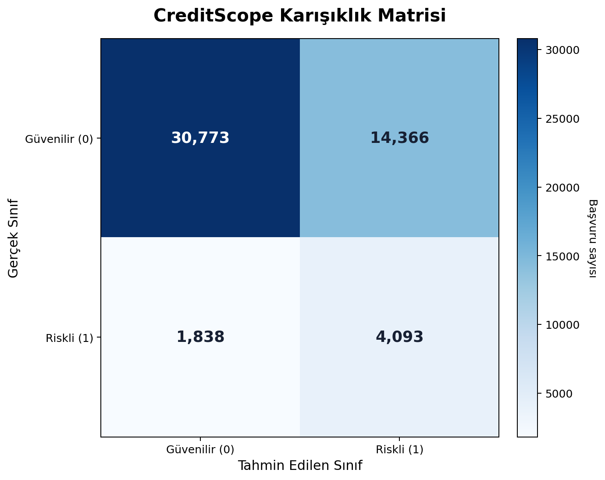
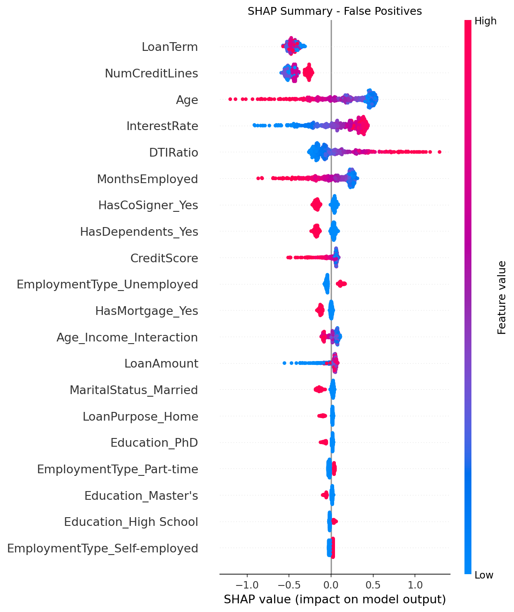
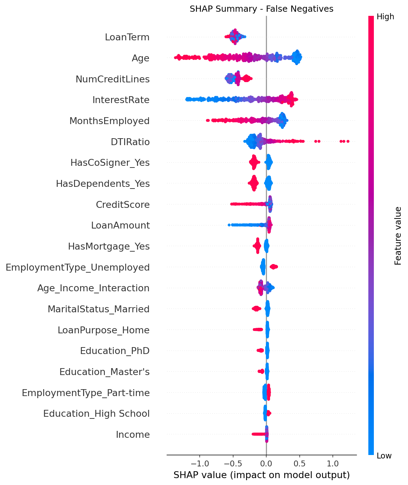

# CreditScope

CreditScope, kredi başvurularında temerrüt riskini tahmin eden, model skorunu şeffaf iş kurallarıyla destekleyen ve sonucu çok sayfalı bir web arayüzünde açıklayan recall odaklı FinTech karar destek prototipidir.

Bu repo bir “model eğittim, skor aldım” çalışması değildir. CreditScope; veri hazırlama, sınıf dengesizliği yönetimi, optimize XGBoost modeli, karar eşiği kalibrasyonu, SHAP tabanlı hata analizi, FastAPI servis katmanı, business rule engine ve Jinja2 tabanlı çok sayfalı UI katmanını tek bir uçtan uca sistemde birleştirir.



## İçindekiler

- [Proje Neyi Çözüyor?](#proje-neyi-çözüyor)
- [Şu Anki Durum](#şu-anki-durum)
- [Hafta 13 Final Öncesi Sağlamlaştırma](#hafta-13-final-öncesi-sağlamlaştırma)
- [Hafta 14 Son Teslim Hazırlığı](#hafta-14-son-teslim-hazırlığı)
- [Sistem Mimarisi](#sistem-mimarisi)
- [Model Stratejisi](#model-stratejisi)
- [Business Rule Engine](#business-rule-engine)
- [Web Arayüzü](#web-arayüzü)
- [API Sözleşmesi](#api-sözleşmesi)
- [Repo Yapısı](#repo-yapısı)
- [Kurulum ve Çalıştırma](#kurulum-ve-çalıştırma)
- [Eğitim, SHAP ve Doğrulama](#eğitim-shap-ve-doğrulama)
- [Kalite Notları](#kalite-notları)
- [Gelecek Çalışmalar](#gelecek-çalışmalar)

## Proje Neyi Çözüyor?

Kredi değerlendirmesinde en kritik hata, gerçekten riskli bir müşteriyi düşük riskli kabul etmektir. Bu yüzden CreditScope, accuracy odaklı klasik bir sınıflandırıcı gibi değil, recall öncelikli bir karar destek sistemi olarak tasarlanmıştır.

Ana fikir şudur:

| İlke | CreditScope Karşılığı |
| --- | --- |
| Riskli müşteriyi kaçırmamak | Recall hedefi model seçiminde ana ölçüt olarak kullanılır |
| Fazla alarmı yönetilebilir kılmak | False Positive vakaları manuel inceleme ile ele alınır |
| Kararı açıklanabilir yapmak | Ham model skoru ve business rule etkileri ayrı gösterilir |
| Modeli ürüne yaklaştırmak | FastAPI + çok sayfalı UI + demo senaryoları birlikte sunulur |

CreditScope doğrudan otomatik kredi onayı veren bir sistem gibi konumlandırılmamıştır. Projenin doğru tanımı: kredi uzmanının kararını hızlandıran, risk sinyallerini görünür yapan ve modeli denetlenebilir hale getiren akademik/ürünleşmiş bir prototip.

## Şu Anki Durum

Hafta 14 itibarıyla proje aşağıdaki seviyeye gelmiştir:

| Alan | Durum |
| --- | --- |
| Veri hazırlama | Ortak training/inference preprocessing tamamlandı |
| Model | SMOTE + tuned XGBoost hattı aktif |
| Threshold | Recall hedefiyle `0.231` olarak kalibre edildi |
| Explainability | False Positive / False Negative SHAP analizi üretildi |
| API | `/predict` endpoint'i aktif ve business rules uyguluyor |
| UI | 5 sayfalı FastAPI + Jinja2 arayüz aktif |
| Demo | 4 doğrulanmış senaryo mevcut |
| Dokümantasyon | Week 10, Week 11, Week 13 ve Week 14 final teslim dokümanları mevcut |

### Aktif Sayfalar

| Route | Sayfa | Rol |
| --- | --- | --- |
| `/` | Risk Kokpiti | Canlı kredi başvurusu skorlama ekranı |
| `/genel-bakis` | Genel Bakış | Projenin amacı, sistem akışı ve baseline özeti |
| `/demo-senaryolari` | Demo Senaryoları | 4 doğrulanmış profil ve karar sonucu |
| `/model-izleme` | Model İzleme | Final metrikler, model karşılaştırması, confusion matrix ve SHAP |
| `/kurallar` | Kurallar | Business rule engine açıklaması |
| `/docs` | API Docs | FastAPI Swagger dokümantasyonu |

## Hafta 13 Final Öncesi Sağlamlaştırma

Hafta 13, yeni model araştırması değil; final jüri demosu öncesi sağlamlaştırma haftasıdır. Bu aşamada Week 12 sonrası tespit edilen kalite bulguları kapatılmış, stress test hattı kurulmuş ve demo/jüri hazırlığı dokümante edilmiştir.

| Çıktı | Konum | Amaç |
| --- | --- | --- |
| Final validation snapshot | `data/final_validation_snapshot.json` | UI sayfalarında kullanılan final metrik ve demo verilerini tek kaynağa toplar |
| Stress test scripti | `tools/week13_stress_test.py` | Route, static asset, API senaryosu, invalid payload ve 100 ardışık predict kontrolü yapar |
| Stress test raporu | `docs/week13/stress_test_report.md` | Hafta 13 test sonuçlarını raporlar |
| Demo runbook | `docs/week13/demo_runbook.md` | Final demo akışını adım adım sabitler |
| Jüri Q&A | `docs/week13/jury_questions.md` | Muhtemel jüri sorularına kısa ve savunulabilir cevaplar hazırlar |
| Wiki HTML | `docs/week13/week13_wiki_final.html` | Hafta 13 wiki sayfası için hazır HTML içerik sunar |

Hafta 13 ile birlikte şu üç kalite notu kapatılmıştır:

- UI snapshot verileri `api.py` içine dağınık şekilde gömülü kalmak yerine tracked snapshot dosyasına taşındı.
- Week 12 route'ları validation smoke test kapsamına eklendi.
- Demo Senaryoları sayfasındaki başarı rozeti pass/fail durumuna göre koşullu hale getirildi.

## Hafta 14 Son Teslim Hazırlığı

Hafta 14, kod geliştirme haftası olarak değil; son doküman kontrolü, yedekleme ve sunum provası haftası olarak ele alınmıştır. Bu aşamada sistem davranışı değiştirilmemiş, mevcut final demo paketinin güvenli biçimde sunulması hedeflenmiştir.

| Çıktı | Konum | Amaç |
| --- | --- | --- |
| Son doküman kontrol listesi | `docs/week14/final_document_checklist.md` | README, wiki, sunum ve raporların teslim öncesi kontrolünü sabitler |
| Yedekleme manifesti | `docs/week14/backup_manifest.md` | Final pakete girmesi gereken kod, model, UI ve doküman dosyalarını listeler |
| Sunum son prova planı | `docs/week14/presentation_rehearsal.md` | Demo sırasında açılacak sayfaları ve anlatılacak ana mesajları sıralar |
| Wiki HTML | `docs/week14/week14_wiki_final.html` | Kısa ve sade Hafta 14 wiki içeriğini sunar |

Hafta 14 sonunda proje "dokunma, bozma; kontrol et, yedekle, prova yap" moduna alınmıştır. Bundan sonraki değişiklikler yalnızca kırık link, yanlış dosya yolu veya demo sırasında görülen somut problem için yapılmalıdır.

## Sistem Mimarisi

```mermaid
flowchart LR
    A["Ham Başvuru Verisi"] --> B["preprocessing.py"]
    B --> C["Feature Engineering"]
    C --> D["Scaler"]
    D --> E["XGBoost Modeli"]
    E --> F["Ham Temerrüt Olasılığı"]
    F --> G["Business Rules"]
    G --> H["Düzeltilmiş Olasılık"]
    H --> I["0.231 Decision Threshold"]
    I --> J["Onaylanabilir Profil / Manuel İnceleme"]
    J --> K["FastAPI JSON + UI Karar Paneli"]
```



### Katmanlar Arası Bağlantı

| Katman | Dosya / Klasör | Sorumluluk |
| --- | --- | --- |
| Veri hazırlama | `preprocessing.py` | Dataset yükleme, feature engineering, encoding, scaling |
| Model eğitimi | `training.py` | SMOTE, XGBoost eğitimi, threshold seçimi, artifact üretimi |
| Açıklanabilirlik | `shap_analysis.py` | FP/FN hata grupları ve SHAP görselleri |
| Servis | `api.py` | FastAPI route'ları, model yükleme, `/predict`, business rules |
| UI layout | `templates/base.html` | Sidebar, header ve ortak sayfa kabuğu |
| Canlı kokpit | `templates/cockpit.html`, `static/script.js` | Form, preset senaryolar, canlı tahmin |
| İzleme ekranı | `templates/monitoring.html` | Metrikler, grafikler, confusion matrix |
| Demo ekranı | `templates/scenarios.html` | Doğrulanmış senaryo kartları |
| Kurallar ekranı | `templates/rules.html` | Business rule açıklamaları |
| Teslim kanıtları | `docs/`, `presentations/` | Raporlar, wiki HTML, sunum |

## Model Stratejisi

CreditScope’un final model hattı şu şekilde sabitlenmiştir:

```text
Shared preprocessing
  -> Feature engineering
  -> StandardScaler
  -> SMOTE
  -> Tuned XGBoost
  -> Recall-oriented threshold calibration
  -> Business rules
  -> Final decision
```

### Feature Engineering

| Feature | Tanım | Neden Önemli? |
| --- | --- | --- |
| `DTIRatio` | `LoanAmount / Income` | Kredi yükünü gelire bağlayan temel risk sinyali |
| `Age_Income_Interaction` | `Age * Income` | Yaş ve gelir sinyalinin birleşik etkisini modele taşır |

`DTIRatio` hem eğitimde hem API inference sırasında yeniden hesaplanır. Böylece frontend tarafından gönderilen değer körü körüne güvenilir kaynak kabul edilmez.

### Final XGBoost Parametreleri

| Parametre | Değer |
| --- | ---: |
| `learning_rate` | `0.08` |
| `max_depth` | `3` |
| `n_estimators` | `220` |
| `subsample` | `0.7` |
| `colsample_bytree` | `0.85` |
| `gamma` | `1.0` |

### Final Performans

| Metrik | Değer | Yorum |
| --- | ---: | --- |
| Accuracy | `0.6827` | Genel doğruluk |
| Precision | `0.2217` | Manuel inceleme maliyeti nedeniyle ikincil metrik |
| Recall | `0.6901` | Ana hedef bandını karşılıyor |
| F1-score | `0.3356` | Precision-recall dengesi |
| Threshold | `0.231` | Recall hedefiyle kalibre edildi |



### Model Karşılaştırması

| Model | Accuracy | Precision | Recall | F1-score | Not |
| --- | ---: | ---: | ---: | ---: | --- |
| Logistic Regression | `0.6885` | `0.2265` | `0.6962` | `0.3417` | Güçlü baseline |
| Random Forest | `0.8117` | `0.2968` | `0.4539` | `0.3589` | Accuracy yüksek ama recall düşük |
| XGBoost Final | `0.6827` | `0.2217` | `0.6901` | `0.3356` | Deploy edilen ana hat |

Logistic Regression recall tarafında çok yakın hatta biraz daha yüksek bir sonuç üretmiştir. Buna rağmen final model XGBoost olarak korunmuştur. Çünkü deploy edilen gerçek sistem yalnızca tek bir metrikle değil; SMOTE entegrasyonu, threshold tuning, SHAP analizi, model artifact uyumu, API entegrasyonu ve business rule katmanıyla birlikte değerlendirilmiştir.

### Confusion Matrix

| Grup | Adet |
| --- | ---: |
| True Negative | `30773` |
| False Positive | `14366` |
| True Positive | `4093` |
| False Negative | `1838` |



False Positive sayısının yüksek olması sistemin temkinli davranmasıyla uyumludur. Bu başvurular manuel inceleme sürecinde elenebilir. False Negative ise kredi riskinde daha kritik hata tipi olduğu için model recall odaklı kalibre edilmiştir.

## SMOTE Teknik Zorluğu

Veri setinde sınıflar dengeli değildir. Bu nedenle SMOTE yalnızca eğitim tarafında uygulanır. Buradaki kritik nokta, sentetik örnek üretimini test setine veya inference hattına sızdırmamaktır.

CreditScope bu dengeyi şu şekilde kurar:

| Risk | Alınan Önlem |
| --- | --- |
| Veri sızıntısı | SMOTE yalnızca train split üzerinde uygulanır |
| Inference uyumsuzluğu | API tarafı SMOTE kullanmaz; gerçek başvuruyu scaler + model hattından geçirir |
| Aşırı alarm üretme | Threshold recall hedefiyle kalibre edilir |
| Yorumlanabilirlik kaybı | SHAP FP/FN analiziyle hata grupları incelenir |

Bu yüzden SMOTE bu projede “basit çoğaltma” değil, model davranışını ve deploy hattını etkileyen bilinçli bir teknik karardır.

## Business Rule Engine

Model olasılığı kredi karar sürecinin tek girdisi değildir. CreditScope, model skorunu bankacılık mantığına yakın şeffaf kurallarla düzeltir.

### Riski Azaltan Kurallar

| Kural | Çarpan | Etki |
| --- | ---: | --- |
| `CreditScore >= 750` | `0.80` | Temerrüt olasılığını `%20` azaltır |
| `DTIRatio <= 0.35` | `0.90` | Temerrüt olasılığını `%10` azaltır |
| `MonthsEmployed >= 36` ve `Full-time` | `0.90` | Temerrüt olasılığını `%10` azaltır |
| `HasCoSigner = Yes` | `0.90` | Temerrüt olasılığını `%10` azaltır |

### Riski Artıran Kurallar

| Kural | Çarpan | Etki |
| --- | ---: | --- |
| `DTIRatio >= 0.50` | `1.20` | Temerrüt olasılığını `%20` artırır |
| `CreditScore < 600` | `1.15` | Temerrüt olasılığını `%15` artırır |
| `Unemployed` veya `MonthsEmployed < 6` | `1.15` | Temerrüt olasılığını `%15` artırır |

Rule version:

```text
default-review-2026-04-19
```

### Karar Mantığı

```text
model_probability
  -> apply_business_rules()
  -> adjusted_probability
  -> adjusted_probability >= decision_threshold
  -> Manuel İnceleme
```

Eğer düzeltilmiş olasılık `0.231` eşiğinin altında kalırsa başvuru `Onaylanabilir Profil` olarak sunulur. Eşik aşılırsa sistem başvuruyu `Manuel İnceleme` bandına alır.

## Web Arayüzü

Hafta 12 ile birlikte arayüz tek ekranlı demodan çok sayfalı bir karar destek prototipine taşınmıştır.

### Risk Kokpiti

Canlı başvuru formu üzerinden model tahmini alınır. Ekran şu bilgileri birlikte gösterir:

| Alan | Açıklama |
| --- | --- |
| Başvuru formu | Yaş, gelir, kredi tutarı, kredi notu, istihdam, vade ve kategorik bilgiler |
| Canlı hesaplar | DTI, kredi/gelir oranı, aylık taksit, kredi segmenti |
| Model sonucu | Ham model skoru ve modelin threshold karar durumu |
| Rule sonucu | Düzeltilmiş skor ve uygulanan kurallar |
| Karar notu | Kredi uzmanına okunabilir kısa değerlendirme |

### Genel Bakış

Projenin amacını, recall mantığını, final teknik baseline’ı ve sistem akışını hızlıca anlatır.

### Demo Senaryoları

4 doğrulanmış profil üzerinden sistemin karar davranışını gösterir:

| Senaryo | Beklenen Karar | Gerçek Karar | Model Skoru | Düzeltilmiş Skor |
| --- | --- | --- | ---: | ---: |
| Düşük Risk | Onaylanabilir Profil | Onaylanabilir Profil | `%8.24` | `%4.81` |
| Manuel İnceleme | Manuel İnceleme | Manuel İnceleme | `%40.01` | `%48.02` |
| Yüksek Risk | Manuel İnceleme | Manuel İnceleme | `%58.04` | `%92.11` |
| Güçlü Skor, Zayıf İstihdam | Manuel İnceleme | Manuel İnceleme | `%26.68` | `%24.54` |

### Model İzleme

Final metrikleri, model karşılaştırmasını, confusion matrix özetini ve SHAP görsellerini tek sayfada toplar.

### Kurallar

Business rule engine’in hangi koşulda riski artırdığını veya azalttığını açıklar. Bu sayfa teknik olmayan kullanıcıların karar mantığını anlaması için tasarlanmıştır.

## API Sözleşmesi

### `POST /predict`

Kredi başvurusunu alır, preprocessing ve model hattından geçirir, business rules uygular ve karar çıktısını döndürür.

Örnek istek:

```json
{
  "Age": 38,
  "Income": 92000,
  "LoanAmount": 18000,
  "CreditScore": 790,
  "MonthsEmployed": 84,
  "NumCreditLines": 2,
  "InterestRate": 9.8,
  "LoanTerm": 36,
  "Education": "Master's",
  "EmploymentType": "Full-time",
  "MaritalStatus": "Married",
  "HasMortgage": "No",
  "HasDependents": "No",
  "LoanPurpose": "Auto",
  "HasCoSigner": "Yes"
}
```

Örnek yanıt:

```json
{
  "risk_durumu": 0,
  "temerrut_olasiligi": 4.81,
  "model_risk_durumu": 0,
  "model_temerrut_olasiligi": 8.24,
  "hesaplanan_dti": 0.1957,
  "business_rule_version": "default-review-2026-04-19",
  "business_rule_adjustments": [
    {
      "id": "strong_credit_score",
      "multiplier": 0.8,
      "before": 8.24,
      "after": 6.59,
      "reason": "CreditScore >= 750: reduce default probability by 20%."
    }
  ],
  "decision_threshold": 0.231
}
```

### Yanıt Alanları

| Alan | Anlamı |
| --- | --- |
| `risk_durumu` | Final karar sınıfı. `0` onaylanabilir profil, `1` manuel inceleme |
| `temerrut_olasiligi` | Business rules sonrası düzeltilmiş risk yüzdesi |
| `model_risk_durumu` | Ham model skorunun threshold’a göre sınıfı |
| `model_temerrut_olasiligi` | XGBoost ham temerrüt olasılığı |
| `hesaplanan_dti` | API tarafında yeniden hesaplanan DTI |
| `business_rule_version` | Kural seti sürümü |
| `business_rule_adjustments` | Uygulanan kural listesi ve önce/sonra etkileri |
| `decision_threshold` | Final karar eşiği |

## Repo Yapısı

```text
CreditScope/
|-- api.py
|   FastAPI app, Jinja2 route'ları, /predict endpoint'i ve business rules
|
|-- preprocessing.py
|   Eğitim ve inference için ortak feature engineering, encoding ve scaling
|
|-- training.py
|   SMOTE + XGBoost eğitimi, threshold araması, artifact üretimi
|
|-- shap_analysis.py
|   False Positive / False Negative hata analizi ve SHAP çıktıları
|
|-- tools/
|   `-- week10_demo_eval.py
|       Demo senaryoları, API smoke test, grafik ve rapor üretimi
|
|-- templates/
|   |-- base.html
|   |-- cockpit.html
|   |-- overview.html
|   |-- scenarios.html
|   |-- monitoring.html
|   `-- rules.html
|
|-- static/
|   |-- style.css
|   |-- script.js
|   `-- figures/
|
|-- docs/
|   |-- week10/
|   `-- week11/
|
|-- presentations/
|   `-- CreditScope_Week11_Final.pptx
|
|-- Loan_default.csv
|-- xgboost_optimized.pkl
|-- scaler.pkl
|-- feature_names.pkl
|-- decision_threshold.pkl
`-- requirements.txt
```

## Kurulum ve Çalıştırma

### 1. Bağımlılıkları Yükleme

```bash
py -m pip install -r requirements.txt
```

Alternatif:

```bash
python -m pip install -r requirements.txt
```

### 2. Uygulamayı Başlatma

```bash
py -m uvicorn api:app --reload
```

### 3. Tarayıcıdan Açma

```text
http://127.0.0.1:8000/
```

Kullanılabilir sayfalar:

```text
http://127.0.0.1:8000/
http://127.0.0.1:8000/genel-bakis
http://127.0.0.1:8000/demo-senaryolari
http://127.0.0.1:8000/model-izleme
http://127.0.0.1:8000/kurallar
http://127.0.0.1:8000/docs
```

## Eğitim, SHAP ve Doğrulama

### Model Eğitimi

```bash
py training.py
```

Üretilen ana artifact’ler:

| Dosya | Rol |
| --- | --- |
| `xgboost_optimized.pkl` | Aktif XGBoost modeli |
| `scaler.pkl` | Eğitimde fit edilen scaler |
| `feature_names.pkl` | Modelin beklediği feature sırası |
| `decision_threshold.pkl` | Recall odaklı karar eşiği |
| `outputs/training/training_metrics.json` | Eğitim metrikleri |
| `outputs/training/confusion_matrix.csv` | Confusion matrix verisi |

### SHAP ve Hata Analizi

```bash
py shap_analysis.py
```

Üretilen ana çıktılar:

| Dosya | Rol |
| --- | --- |
| `outputs/shap/shap_summary_False_Positives.png` | False Positive SHAP analizi |
| `outputs/shap/shap_summary_False_Negatives.png` | False Negative SHAP analizi |
| `outputs/shap/error_analysis_feature_means.csv` | Hata gruplarına göre feature ortalamaları |
| `outputs/shap/shap_error_analysis_summary.json` | SHAP ve hata analizi özeti |





### Demo / Teslim Doğrulaması

```bash
py tools/week10_demo_eval.py
```

Bu komut şu kanıt dosyalarını yeniler:

| Dosya | Rol |
| --- | --- |
| `outputs/week10/demo_predictions.json` | Demo senaryosu sonuçları |
| `outputs/week10/api_smoke_test.json` | API smoke test çıktısı |
| `outputs/week10/model_comparison_metrics.csv` | Model karşılaştırma metrikleri |
| `docs/week10/results_discussion.md` | Results & Discussion metni |
| `docs/week10/demo_test_report.md` | Demo test raporu |

Hafta 12 manuel HTTP doğrulamasında alınan sonuçlar:

| Kontrol | Sonuç |
| --- | --- |
| `GET /` | `200` |
| `GET /genel-bakis` | `200` |
| `GET /demo-senaryolari` | `200` |
| `GET /model-izleme` | `200` |
| `GET /kurallar` | `200` |
| `POST /predict` | `200` |

### Hafta 13 Stress Test

```bash
py tools/week13_stress_test.py
```

Bu script final demo öncesinde şu kontrolleri yapar:

| Kontrol | Açıklama |
| --- | --- |
| UI route'ları | 5 aktif sayfanın `200` dönmesini kontrol eder |
| Static asset'ler | CSS, JS ve model izleme görsellerini kontrol eder |
| Predict senaryoları | Düşük risk, manuel inceleme, yüksek risk ve edge-case profilleri çalıştırır |
| Invalid payload | Eksik/geçersiz veri için kontrollü API hatası bekler |
| Ardışık istek | 100 adet `/predict` isteğini hata vermeden tamamlamayı hedefler |

Çıktılar:

| Dosya | Rol |
| --- | --- |
| `outputs/week13/stress_test_results.json` | Makine okunabilir stress test sonucu |
| `docs/week13/stress_test_report.md` | Teslim edilebilir stress test raporu |

## Teslim Dokümanları

| Konum | Açıklama |
| --- | --- |
| `docs/week10/results_discussion.md` | Model sonuçları, grafikler ve tartışma |
| `docs/week10/demo_test_report.md` | Demo senaryosu test raporu |
| `docs/week11/final_model_selection.md` | Final model seçimi ve doğrulama gerekçesi |
| `docs/week11/future_work.md` | Gelecek çalışma planı |
| `docs/week11/presentation_storyboard.md` | Slayt slayt sunum akışı |
| `docs/week11/week11_wiki_final.html` | Wiki’ye yapıştırılabilir Hafta 11 HTML |
| `docs/week13/stress_test_report.md` | Hafta 13 stress test raporu |
| `docs/week13/demo_runbook.md` | Final demo akış planı |
| `docs/week13/jury_questions.md` | Jüri soru-cevap hazırlığı |
| `docs/week13/week13_wiki_final.html` | Wiki’ye yapıştırılabilir Hafta 13 HTML |
| `docs/week14/final_document_checklist.md` | Son doküman kontrol listesi |
| `docs/week14/backup_manifest.md` | Final yedekleme manifesti |
| `docs/week14/presentation_rehearsal.md` | Sunum son prova planı |
| `docs/week14/week14_wiki_final.html` | Wiki’ye yapıştırılabilir kısa Hafta 14 HTML |
| `presentations/CreditScope_Week11_Final.pptx` | Final sunum dosyası |

## Kalite Notları

Proje çalışır ve demo seviyesinde doğrulanmış durumdadır. Week 13 kapsamında Week 12 incelemesinde bulunan üç ana kalite notu kapatılmıştır:

| Not | Açıklama |
| --- | --- |
| Snapshot single source of truth | UI sayfalarında gösterilen metrik ve senaryo verileri tracked snapshot dosyasından okunur |
| Week 12 route smoke tests | Yeni route’lar validation script kapsamına eklendi |
| Scenario badge rendering | Demo senaryosu rozeti `expected == actual` sonucuna göre koşullu render edilir |

Kalan kalite başlıkları artık daha çok production-readiness tarafındadır: monitoring, drift takibi, fairness validasyonu, auth ve audit logging.

## Bu Proje Ne Değildir?

CreditScope gerçek bir bankacılık karar motoru olarak doğrudan kullanılmamalıdır. Akademik ve prototip seviyesinde bir karar destek sistemidir.

Bu repo şu kapsamları içermez:

| Kapsam Dışı | Neden |
| --- | --- |
| Gerçek müşteri verisi | Kullanılan veri akademik/proje veri setidir |
| Otomatik kredi onayı | Sistem karar desteği sağlar, nihai karar vermez |
| Auth ve rol yönetimi | Demo/prototip kapsamının dışındadır |
| Production monitoring | Gelecek çalışma olarak planlanmıştır |
| Regülasyon/fairness sertifikasyonu | Ayrı doğrulama süreci gerektirir |

## Gelecek Çalışmalar

| Öncelik | Geliştirme |
| --- | --- |
| 1 | Business rule etkilerini tarihsel veriyle kalibre etmek |
| 2 | Week 12 route’larını otomatik smoke test kapsamına almak |
| 3 | UI snapshot verilerini tek kaynaklı hale getirmek |
| 4 | Maliyet-duyarlı threshold optimizasyonu yapmak |
| 5 | Monitoring ve drift takibi eklemek |
| 6 | Kullanıcı bazlı karar gerekçesi ekranını güçlendirmek |
| 7 | Fairness, bias ve regülasyon kontrollerini genişletmek |

## Ekip

| İsim |
| --- |
| Arda Şengün |
| Baran Atıcı |
| Ahmet Faruk Uysal |
| Emirhan Laleli |

## Son Söz

CreditScope, Hafta 12 sonunda yalnızca çalışan bir model demosu değildir. Recall odaklı modelleme stratejisi, SMOTE + XGBoost eğitim hattı, kalibre karar eşiği, SHAP hata analizi, business rule engine, FastAPI servis katmanı ve çok sayfalı UI ile birlikte modüler ve açıklanabilir bir kredi karar destek prototipidir.

Projenin temel başarısı tek bir skor tablosundan değil; model, kural, açıklanabilirlik ve kullanıcı arayüzünü aynı karar akışında birleştirmesinden gelir.
